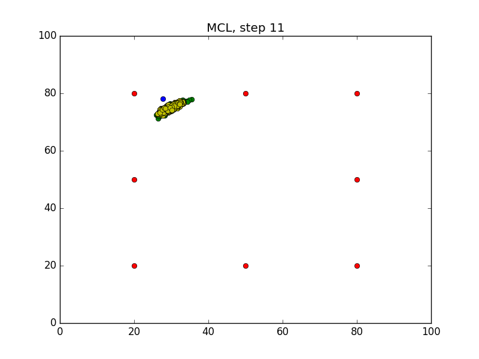

# RSEND Lab: Particle Filter (MCL)

Observing the Monte Carlo Localization (aka Particle Filter) in action through plots generated at every step for 50 steps. 

### Compiling the Program
```sh
$ cd /home/workspace/
$ git clone https://github.com/ivogeorg/RSEND-Lab-Particle-Filter.git
$ cd RSEND-Lab-Particle-Filter/
$ rm -rf Images/*
$ g++ main.cpp -o mcl -std=c++11 -I/usr/include/python2.7 -lpython2.7
```

### Running the Program
Before you run the program, make sure the `Images` folder is empty!
```sh
$ ./mcl
```
Wait for the program to iterate `50` times.

### Generated Images
After running the program, `50` images will be generated in the `Images` folder.

| Before step | After step |
| --- | --- |
|  |  |
|  |  |
|  |  |
|  |  |
|  |  |
|  |  |

